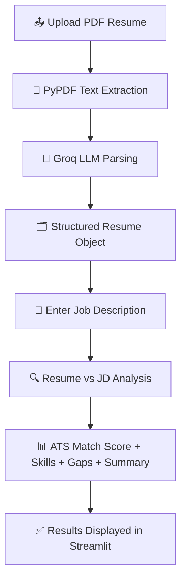

<div align="center">

<!-- Typing SVG Header -->
<a href="https://github.com/Aditya2007raj/AI-Resume-Analyzer">
  
</a>

<br/>

<!-- Badges -->
<p>
  
  
  
  
  
</p>

<p>
  
  
  
  
</p>

</div>

---

## 📖 Overview

**AI Resume Analyzer** is an intelligent resume evaluation system that helps job seekers understand how well their resumes align with specific job descriptions.

It extracts information from uploaded resumes, converts it into structured data using **Large Language Models (LLMs)**, and compares it against a job description to generate **ATS-style compatibility insights** — matching skills, missing skills, and actionable recommendations.

---

## ❓ Problem Statement

Recruiters often receive hundreds of resumes for a single position. Candidates usually struggle to determine:

- Whether their resume matches the target role
- Which skills are missing
- How ATS systems may evaluate their profile

**AI Resume Analyzer automates that evaluation process and provides actionable feedback.**

---

## 🎯 Objectives

- 📄 Extract structured information from resumes
- 🧩 Identify candidate skills and experience
- 🔍 Compare resumes against job descriptions
- 📊 Calculate ATS-style compatibility scores
- ❌ Detect missing skills
- 💡 Generate professional hiring insights

---

## 🏗️ System Architecture

```text
PDF Resume
     │
     ▼
PDF Text Extraction
     │
     ▼
Resume Parsing Engine
     │
     ▼
Structured Resume Object
     │
     ├────────► Resume Details
     │
     ▼
Job Description Matcher
     │
     ▼
ATS Evaluation Engine
     │
     ▼
Analysis Report
```

---

## 🛠️ Tech Stack

| Layer | Technology |
|---|---|
| 🖥️ Frontend | Streamlit |
| ⚙️ Backend | Python |
| 🧠 LLM Framework | LangChain |
| ⚡ LLM Provider | Groq |
| 🤖 Model | Llama 3.3 70B Versatile |
| ✅ Data Validation | Pydantic |
| 📑 PDF Processing | PyPDF |
| 🔐 Configuration Management | python-dotenv |

---

## 📂 Project Structure

```text
AI-Resume-Analyzer/
│
├── main.py
├── parser.py
├── matcher.py
├── models.py
├── prompt.py
├── requirements.txt
├── Documentation.md
├── README.md
│
└── uploads/
```

---

## 🧩 Module Breakdown

<details>
<summary><b>📌 main.py</b> — Main Streamlit application</summary>
<br/>

- User Interface
- Resume Upload
- Job Description Input
- ATS Result Visualization
- Session Management

</details>

<details>
<summary><b>📌 parser.py</b> — Resume extraction & parsing</summary>
<br/>

- Reading PDF files
- Extracting text
- Creating LLM structured output chains
- Converting raw resume text into `Resume` objects

**Key Functions:** `get_llm()` • `load_resume_text_from_bytes()` • `parse_resume()`

</details>

<details>
<summary><b>📌 matcher.py</b> — Resume ↔ JD comparison</summary>
<br/>

- Resume and JD comparison
- ATS evaluation
- Skill mapping
- Match score generation

**Key Function:** `match_resume_to_jd()`

</details>

<details>
<summary><b>📌 models.py</b> — Pydantic validation schemas</summary>
<br/>

**Main Models:** `Resume` • `Education` • `Experience` • `Project` • `JDMatchResult`

These schemas act as structured contracts between the application and the LLM.

</details>

<details>
<summary><b>📌 prompt.py</b> — LLM prompt templates</summary>
<br/>

**Resume Prompt** — used for resume extraction, skill extraction, experience extraction, education extraction

**JD Match Prompt** — used for ATS scoring, skill comparison, gap analysis, hiring summary generation

</details>

---

## 🔄 Application Workflow



---

## ✨ Features

### 📄 Resume Parsing
Extracts Candidate Name, Contact Information, Skills, Education, Work Experience, Projects, and Technology Stack.

### 📊 ATS Style Analysis
Provides Match Score, Matching Skills, Missing Skills, Strengths, Gaps, and Hiring Summary.

### ✅ Structured Output
All extracted data is validated using Pydantic models to ensure consistency and reliability.

### 🖥️ Interactive Dashboard
Built with Streamlit — Resume Upload, Job Description Input, Real-time Analysis, ATS Insights, and a Professional UI.

---

## ⚙️ Installation

**1. Clone the repository**
```bash
git clone https://github.com/Aditya2007raj/AI-Resume-Analyzer.git
cd AI-Resume-Analyzer
```
*(Update the URL above if your repo lives under a different GitHub account.)*

**2. Create a virtual environment**
```bash
python -m venv .venv
```

**3. Activate it**

Windows:
```bash
.venv\Scripts\activate
```

Linux / Mac:
```bash
source .venv/bin/activate
```

**4. Install dependencies**
```bash
pip install -r requirements.txt
```

---

## 🔑 Environment Variables

Create a `.env` file in the root directory:

```env
GROQ_API_KEY=your_groq_api_key
```

---

## ▶️ Running the Application

```bash
streamlit run main.py
```

---

## 📤 Example Output

**ATS Score**
```text
87%
```

**✅ Matched Skills**
```text
Python
FastAPI
Docker
PostgreSQL
```

**❌ Missing Skills**
```text
AWS
Kubernetes
CI/CD
```

**📝 Summary**
```text
Candidate demonstrates strong backend development capabilities with relevant
project experience. Additional exposure to cloud technologies and deployment
pipelines would improve alignment with the target role.
```

---

## ⚠️ Limitations

- ATS score is AI-generated and not equivalent to commercial ATS platforms
- Resume quality affects extraction accuracy
- PDF-only support
- Depends on LLM response quality

---

## 🚀 Future Improvements

- [ ] Resume History
- [ ] Authentication System
- [ ] Multiple Resume Support
- [ ] ChromaDB Integration
- [ ] RAG-Based Recommendations
- [ ] Interview Question Generator
- [ ] Resume Improvement Suggestions
- [ ] Multi-Agent Evaluation Workflow

---

## 🤝 Contributing

Contributions, issues, and feature requests are welcome!
Feel free to check the [issues page](https://github.com/Aditya2007raj/AI-Resume-Analyzer/issues).

---

## 📜 License

This project is licensed under the **MIT License**.

---

<div align="center">

## 👤 Author

**Aditya Raj Singh Shekhawat**

Arya College of Engineering · Computer Science & Artificial Intelligence (CSAI)

<p>
  <a href="https://github.com/Aditya2007raj"></a>
  <a href="https://linkedin.com/in/your-linkedin"></a>
</p>

Built with 🐍 Python, 🎈 Streamlit, 🦜 LangChain, and ⚡ Groq


</div>
